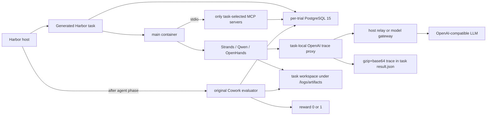

# Harbor architecture

## Goal and boundary

The adapter changes orchestration, not benchmark semantics. The canonical task
prompt, `preprocess/main.py`, initial workspace, task-specific MCP selection,
seeded PostgreSQL state, `evaluation/main.py`, and ground truth are taken from
Cowork Bench commit `b3aacb52ac1fbd9b0369105c25bc828ddc44f85d`.

Harbor owns trial isolation, Compose project lifecycle, agent invocation, log
collection, verifier execution, retries, and result aggregation. The adapter
translates each Cowork task into Harbor's task layout and bridges the original
runtime contract to Harbor agents.

## Why PostgreSQL exists

PostgreSQL is not agent memory or telemetry. It is the deterministic local
state of the mocked office services: calendar, mail, sheets, forms, LMS,
e-commerce, finance, HR, knowledge base, video catalog, and related domains.
MCP tools read and mutate that state. Evaluators inspect both generated files
and database side effects, so replacing the database with stateless mocks would
change the benchmark.

Every Harbor trial gets a fresh PostgreSQL container initialized from `db/`.
`PGDATA` is tmpfs, the database has no published host port, and Compose gives
legacy hostname `cowork_pg` as a network-local alias. This prevents state and
port collisions when trials run concurrently.

## MCP topology (baseline v1)

On `main` / v1, MCP servers are child processes inside `main`, not Compose
services. The adapter reads `needed_mcp_servers` from the current task's
`task_config.json` and constructs only those stdio servers. It fails if any
requested config is missing. A task therefore never receives all benchmark
tools by default.

The v1 release preflight used nine real tasks as a set cover for all 26 unique
MCP types. For every selected server it performed MCP `initialize`,
`tools/list`, and a conservative real tool call.

## Harbor-canonical packaging

Task semantics are unchanged. Transport is HTTP: task-local gateways expose the
same stdio binaries, and the agent sees a single facade at
`http://mcp-gateway-public:8000/mcp/<name>`, which reverse-proxies an internal
db gateway and workspace gateway. Compose is seven services (`postgres`,
`workspace-prep`, `grader`, `mcp-gateway-db`, `mcp-gateway-workspace`,
`mcp-gateway-public`, `main`).

`main` runs on `agent_net` only, with no PostgreSQL credentials and no DNS to
`postgres` or `grader`; DB-backed grading happens in the `grader` sidecar on
`db_net` and hands `reward.txt` back through a read-only mount. Any stock Harbor
agent consumes the `task.toml` MCP URLs; Cowork-specific agent classes are not
used on that path. Historical stdio wrappers remain.
See [`HARBOR_CANONICAL_PACKAGING.md`](./HARBOR_CANONICAL_PACKAGING.md).

## Agent wrappers (baseline v1)

| Wrapper | Implementation | Workspace and setup | Release status |
|---|---|---|---|
| Qwen Code | Harbor installed-agent adapter plus Cowork mixin | Same preprocess/database/MCP; real process cwd forced to task workspace | Supported |
| OpenHands | Harbor OpenHands adapter plus Cowork mixin | Same preprocess/database/MCP; Python 3.12.11 | Experimental |
| MCP preflight | No LLM | Same task setup; SDK-level MCP checks | Release gate |

For CLI agents, merely adding “cd to the workspace” to a prompt is insufficient:
shell/file tools can still use the process working directory. The mixin enforces
the task artifact workspace as the actual cwd for registration and execution.

## Evaluation and answer-key isolation

The main image deletes `evaluation`, `groundtruth_workspace`, and
`groundtruth_workspace_cn` from the task tree. Harbor uploads `/tests` only
after the agent phase. `tests/test.sh` then restores the paths expected by the
original evaluator and runs `scripts/run_eval.py`. The adapter maps evaluator
exit status to `/logs/verifier/reward.txt`; it does not implement a new metric.

## Exact model traces

Each trial starts a proxy on container loopback (`127.0.0.1:19080` by default),
so no host port is shared. The proxy records the exact OpenAI-compatible JSON
request sent to the model, including ordered `messages`, complete `tools`
schemas, tool call ids/arguments, raw streaming events or non-stream response,
and provider reasoning fields. `reasoning` is additionally normalized to
`reasoning_content`; raw provider data is retained.

At completion, canonical JSON is compressed deterministically and embedded in
the same trial `result.json` under `agent_result.metadata`. SHA-256 is computed
over the uncompressed bytes. Separate per-turn files are deleted only after the
archive is attached, preserving task association while limiting disk usage.

For direct training/evaluation consumption, the same metadata also contains
`messages` and `tools` in OpenAI Chat Completions format. Because requests are
cumulative, the final request is the authoritative model-visible linear
history; the final successful assistant response is appended once. The
`messages_info` object records the source trace and unmatched/orphan tool ids.
